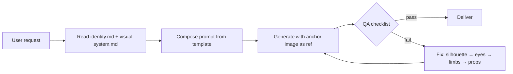

<p align="center">
  
</p>

<p align="center">
  <a href="./README.zh-CN.md">简体中文</a>
  ·
  <a href="https://opensource.org/licenses/MIT"></a>
  
  
  <a href="https://github.com/chenguang-jiang/jcg-documentation-pet/actions/workflows/test.yml"></a>
</p>

> **Character consistency > scene detail > decoration.**
> One anchor image. Four reference docs. Zero drift.

---

## Highlights

| | Feature | Detail |
|---|---|---|
|  | **Identity lock** | Head + body = one continuous pear-shaped black mass. No neck, no separate head, no ant-like anatomy. Enforced by `identity.md`. |
| 👀 | **Two uneven white eyes** | Exactly two small white dot eyes, slightly misaligned. No mouth, no pupils, no blush. Deadpan serious gaze. |
| 🟠 | **Single belly mark** | One tiny flat orange-red semicircle on the lower belly. Not a mouth. Never moves to the face. |
| 📐 | **Visual system** | Pure black character on pure white background. Props drawn with sparse, slightly wobbly thin black lines. No gradients, no 3D, no gloss. |
| 📝 | **Prompt templates** | Ready-to-use templates with character invariants, style constraints, and iteration phrases for partial edits. |
| ✅ | **QA checklist** | Post-generation checklist: identity consistency, style compliance, failure signals, and fix order. |
| 🖼️ | **Anchor image** | `dawn-pet-anchor.png` — three poses (standing, carrying box, sitting) that define the single source of truth. |
| 🧪 | **20 contract tests** | Validates SKILL.md structure, reference files, anchor image, agent config, and repo assets. CI on every push. |

## What it is

`jcg-documentation-pet` is a Codex Skill that generates and edits a **consistent clumsy black mascot character** called **Dawn Pet** for DawnVibe documentation. It ensures every generated image — avatars, pose sheets, editorial illustrations, or partial edits — maintains the same character identity.

The skill works by:

1. **Locking identity** from a single anchor image (`dawn-pet-anchor.png`).
2. **Applying invariants** from `identity.md` (silhouette, face, limbs, belly mark).
3. **Composing prompts** from `prompt-template.md` with character constraints baked in.
4. **Checking output** against `qa-checklist.md` before delivery.

## How it works



## Asset types

| Type | Canvas | Rules |
|---|---|---|
| **Avatar / hero** | Square or landscape, white bg | Single character, complete silhouette |
| **Pose sheet** | Landscape, white bg | Up to 3 separated poses, identical identity |
| **Editorial scene** | 16:9, white bg | One action, one prop, character is focus |
| **Partial edit** | Same as original | Only modify named parts, keep everything else |

## Character invariants

- **Body**: one short, wide, softly asymmetric pear-shaped solid-black mass
- **Face**: exactly two small slightly-uneven white dot eyes; no mouth
- **Limbs**: very short rounded arms, short sturdy legs, oversized flat feet
- **Belly**: one tiny flat orange-red semicircle, centered low
- **Style**: solid black fill, no gradients/texture/shading; props = sparse wobbly lines
- **Palette**: black + white + one orange-red accent only

## Install

```bash
# one-line
npx skills add chenguang-jiang/jcg-documentation-pet

# or manual
git clone https://github.com/chenguang-jiang/jcg-documentation-pet.git
ln -s "$PWD/jcg-documentation-pet/skills/jcg-documentation-pet" ~/.codex/skills/
```

Self-check:

```bash
python3 ~/.codex/skills/jcg-documentation-pet/tests/test_skill_contract.py
```

## Use

```text
/skill:jcg-documentation-pet
```

or in a prompt:

```text
Use jcg-documentation-pet to generate a 16:9 illustration of Dawn Pet
seriously trying to push an oversized folder across a white page.
```

## Repository layout

```text
jcg-documentation-pet/
├── README.md / README.zh-CN.md
├── LICENSE · CHANGELOG.md · .gitignore
├── assets/readme/hero.svg
├── .github/workflows/test.yml
└── skills/jcg-documentation-pet/
    ├── SKILL.md
    ├── agents/openai.yaml
    ├── assets/identity/dawn-pet-anchor.png
    ├── references/
    │   ├── identity.md
    │   ├── visual-system.md
    │   ├── prompt-template.md
    │   └── qa-checklist.md
    └── tests/
        └── test_skill_contract.py   (21 assertions)
```

## License

[MIT](./LICENSE) © [chenguang-jiang](https://github.com/chenguang-jiang)
