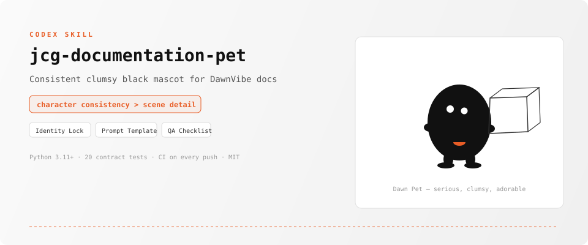
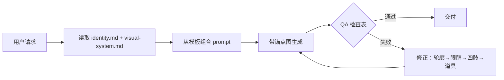

<p align="center">
  
</p>

<p align="center">
  <a href="./README.md">English</a>
  ·
  <a href="https://opensource.org/licenses/MIT"></a>
  
  
  <a href="https://github.com/chenguang-jiang/jcg-documentation-pet/actions/workflows/test.yml"></a>
</p>

> **角色一致性 > 场景细节 > 装饰效果。**
> 一张锚点图。四份参考文档。零漂移。

---

## 亮点

| | 特性 | 说明 |
|---|---|---|
| 🔒 | **身份锁定** | 头+身体=一整块连续梨形黑团。没有脖子、独立头部或蚂蚁式分节。由 `identity.md` 强制执行。 |
| 👀 | **两只错位白眼** | 恰好两只小白圆眼，轻微高低/间距差。没有嘴、瞳孔、腮红。认真放空的凝视。 |
| 🟠 | **唯一肚标** | 下腹正中一个极小的橙红色扁半圆。不是嘴。永远不移动到脸上。 |
| 📐 | **视觉系统** | 纯黑角色+纯白背景。道具用稀疏、略抖的细黑线。无渐变、无 3D、无光泽。 |
| 📝 | **提示词模板** | 即用的模板，内含角色不变量、风格约束和局部迭代句式。 |
| ✅ | **QA 检查表** | 生成后检查：身份一致性、风格合规、失败信号、修正顺序。 |
| 🖼️ | **锚点图** | `dawn-pet-anchor.png`——三个姿势（站立、搬箱、坐倒）定义唯一身份真相。 |
| 🧪 | **22 项契约测试** | 验证 SKILL.md 结构、参考文件、锚点图、agent 配置和仓库资产。每次 push 自动 CI。 |

## 这是什么

`jcg-documentation-pet` 是一个 Codex Skill，为 DawnVibe 文档生成和编辑**保持一致性的蠢萌黑色吉祥物角色** Dawn Pet。它确保每张生成的图——头像、动作设定图、正文配图或局部编辑——都维持相同的角色身份。

工作流程：

1. **锁定身份**：从唯一锚点图（`dawn-pet-anchor.png`）读取。
2. **应用不变量**：从 `identity.md` 获取轮廓、面部、四肢、肚标规则。
3. **组合提示词**：从 `prompt-template.md` 生成带角色约束的 prompt。
4. **检查输出**：对照 `qa-checklist.md` 验收后交付。

## 工作原理



## 资产类型

| 类型 | 画布 | 规则 |
|---|---|---|
| **头像/主视觉** | 方形或横向白底 | 单角色，完整轮廓 |
| **动作设定图** | 横向白底 | 最多 3 个分离姿势，身份一致 |
| **正文场景配图** | 16:9 白底 | 一个动作、一个道具、角色为焦点 |
| **局部编辑** | 与原图相同 | 只改点名部分，其余不变 |
| **流程图解** | 16:9 白底 | 3–5 节点；每节点同一个 Dawn Pet，细线箭头，节点下手写标签 |

## 角色不变量

- **身体**：矮、宽、略不对称的梨形纯黑实心团
- **面部**：恰好两只略错位的小白圆眼；没有嘴
- **四肢**：极短圆钝手臂、短粗腿、略大扁平脚
- **肚标**：下腹正中一个极小橙红扁半圆
- **风格**：纯黑填充，无渐变/纹理/阴影；道具=稀疏抖动细线
- **色彩**：黑+白+唯一橙红点缀

## 安装

```bash
# 一行安装
npx skills add chenguang-jiang/jcg-documentation-pet

# 或手动
git clone https://github.com/chenguang-jiang/jcg-documentation-pet.git
ln -s "$PWD/jcg-documentation-pet/skills/jcg-documentation-pet" ~/.codex/skills/
```

自检：

```bash
python3 ~/.codex/skills/jcg-documentation-pet/tests/test_skill_contract.py
```

## 使用

```text
/skill:jcg-documentation-pet
```

或在 prompt 里：

```text
用 jcg-documentation-pet 生成一张 16:9 配图：Dawn Pet 认真推一个
超大的文件夹，白底，文件夹只用稀疏手绘黑线。
```

## 仓库结构

```text
jcg-documentation-pet/
├── README.md / README.zh-CN.md
├── LICENSE · CHANGELOG.md · .gitignore
├── assets/readme/hero.svg
├── .github/workflows/test.yml
└── skills/jcg-documentation-pet/
    ├── SKILL.md
    ├── agents/openai.yaml
    ├── assets/identity/dawn-pet-anchor.png
    ├── references/
    │   ├── identity.md
    │   ├── visual-system.md
    │   ├── prompt-template.md
    │   └── qa-checklist.md
    └── tests/
        └── test_skill_contract.py   (22 项断言)
```

## 许可证

[MIT](./LICENSE) © [chenguang-jiang](https://github.com/chenguang-jiang)
